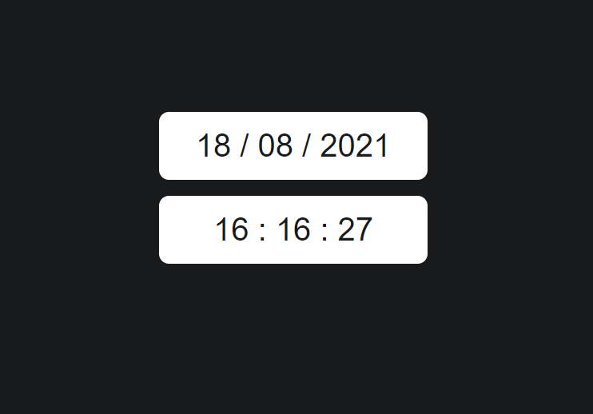

# Realtime-Clock

## A Simple Realtime Clock.

 

---

## 🚀 Technologies

- HTML
- CSS
- JavaScript

---

<h2> 🔖 License <h2>

<h3>

The Project license are MIT. See [LICENSE](LICENSE.md) file for more details.

</h3>
